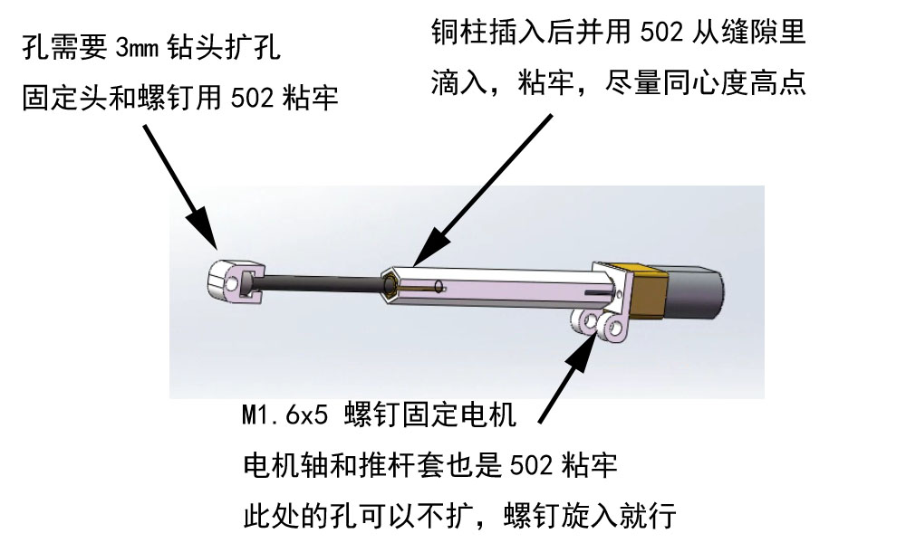
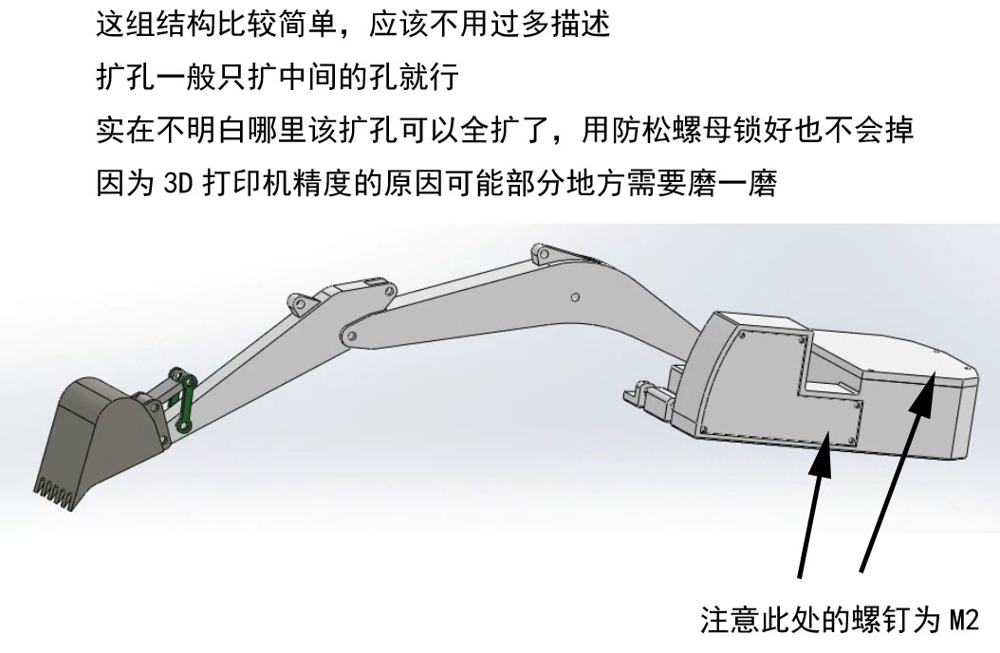
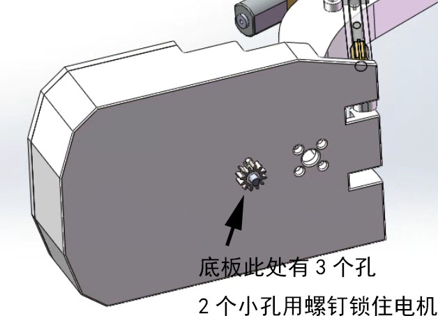
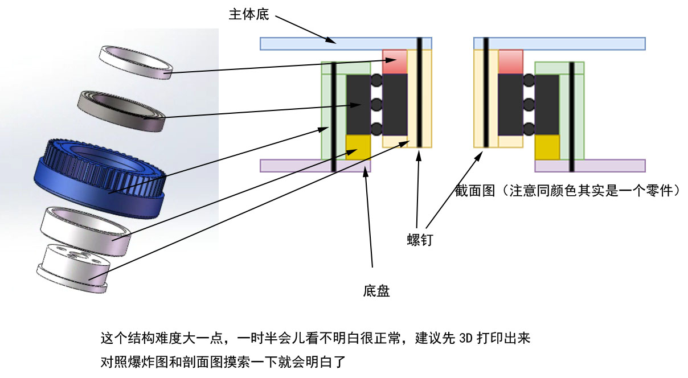
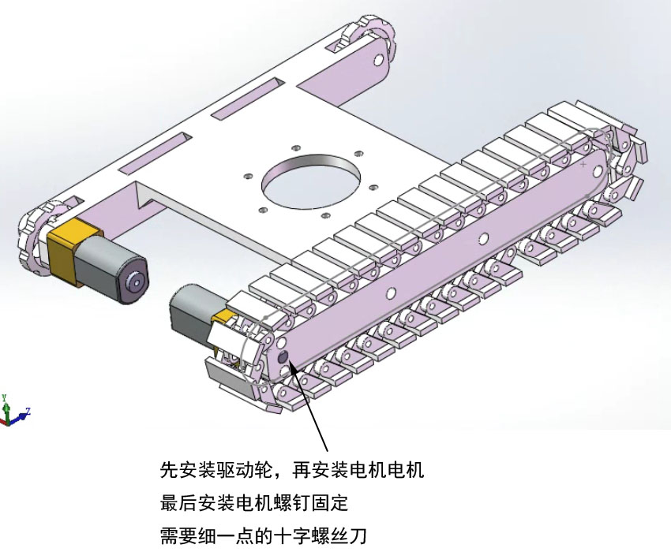
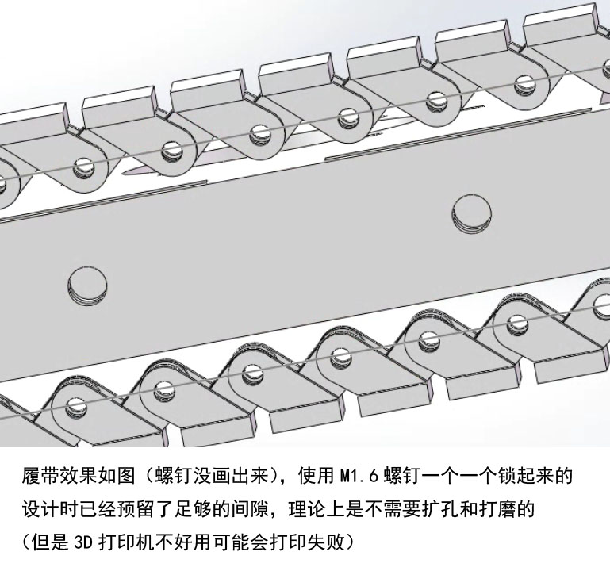

## 资料开源说明

机械设计图：sw2016

3D打印结构件：STL

程序代码和固件

**以上资料均在本仓库更新**

遥控器和接收板的电路原理图和pcb文件：使用立创EDA专业版设计，已在立创开源平台开源

https://oshwhub.com/eyhxh/rev6ch_2022-08-29

https://oshwhub.com/eyhxh/rc_2022-08-29

**QQ交流群：128978324**

视频演示，教程上B站视频搜索----不搞搞事不自在

或者点下面的链接

https://www.bilibili.com/video/BV1jG4y1h7KU/

## 安装说明

### 推杆3个
推杆使用N20减速电机、M3铜柱12mm长度、M3螺钉、加3D打印件组成

3个推杆仅仅推杆套和螺钉长度不同，材料，安装工艺等完全一致。

注意推杆电机要用速度快一点的电机，否则整个臂都是蜗牛速度，高速电机的力度经测试完全足够！

挖斗推杆：螺钉长度35mm  推杆套长度40mm

小臂推杆：螺钉长度50mm  推杆套长度55mm

大臂推杆：螺钉长度45mm  推杆套长度50mm

### 主体结构
主体结构比较简单，如图安装即可

### 底盘旋转电机
底盘旋转电机需要先安装好，注意使用低速电机，否则底盘和电风扇一样快

### 底盘旋转结构 

### 底盘结构
底盘2个电机建议使用低速电机，否则挖掘机和AE86一样

### 履带效果

## 更新日志
2022年11月8日16:29:45

1、添加初版代码、资料

2、如有问题可以在QQ群反馈

3、目前版本存在一些已知问题，但是整体上完成度已经较高，当然后续会不断改进。多谢关注
